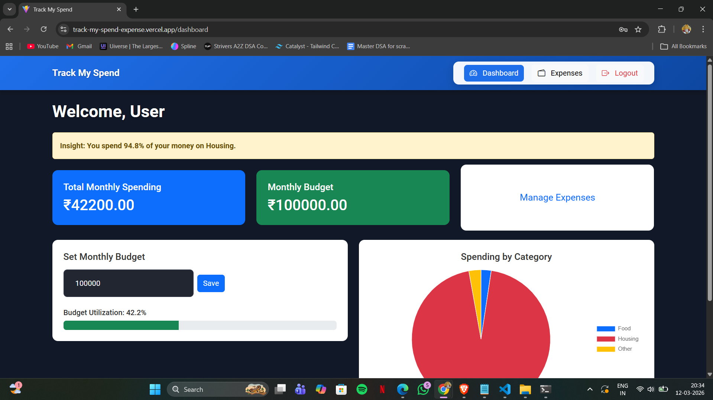
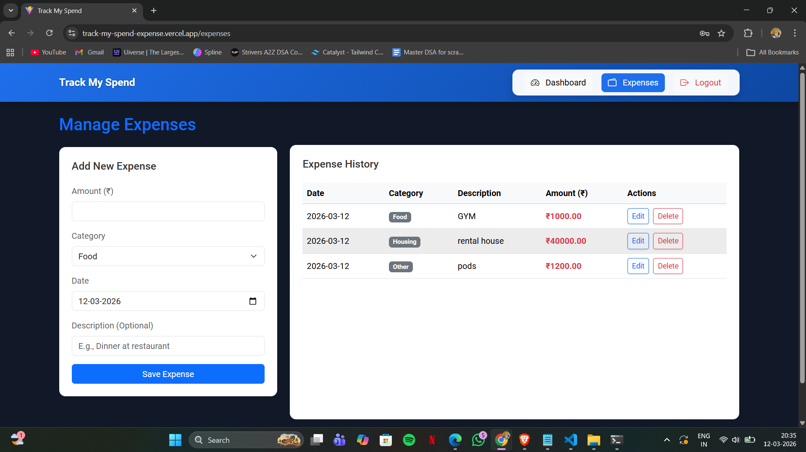
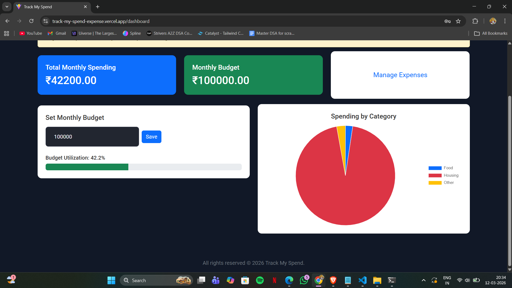

# Track My Spend

Track My Spend is a full-stack expense tracking web application built using **React, Bootstrap, and FastAPI**.  
It helps users manage expenses, set monthly budgets, and visualize spending patterns through interactive charts.

---

## 🚀 Live Demo

Frontend:  
https://track-my-spend-expense.vercel.app/login

Backend API:  
https://trackmyspend-api.onrender.com

---

## ✨ Features

- Add and manage expenses
- Set and track monthly budget
- Spending insights dashboard
- Category-based analytics
- Interactive charts for visualizing spending patterns

---

## 🛠 Tech Stack

**Frontend**
- React
- Bootstrap

**Backend**
- FastAPI

**Charts**
- Chart.js

---

## 📂 Project Structure

```
TrackMySpend-Full-Stack-Expense-Tracker
│
├── backend        # FastAPI backend
│
├── frontend       # React frontend
│
└── README.md
```

---

## 📸 Screenshots

### Dashboard


### Expenses Page


### Budget Tracking


---

## ⚙️ Installation

Clone the repository

```bash
git clone https://github.com/saiabhay2006-jpg/TrackMySpend-Full-Stack-Expense-Tracker.git
```

### Backend Setup

```bash
cd backend
pip install -r requirements.txt
uvicorn main:app --reload
```

### Frontend Setup

```bash
cd frontend
npm install
npm run dev
```

---

## 📌 Future Improvements

- User authentication
- Expense export (CSV / PDF)
- Multi-user support
- Mobile responsive enhancements

---

## 📄 License

This project is licensed under the **MIT License**.

---

## 👨‍💻 Author

**Sai Abhay**

🔗 LinkedIn: https://www.linkedin.com/in/sai-abhay  
💻 GitHub: https://github.com/saiabhay2006-jpg